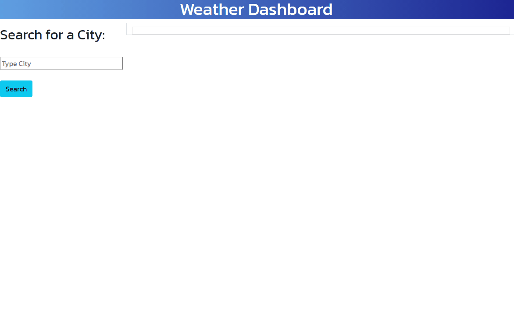

# adrianos-weather-dashboard-6

Homework 6 - Weather Dashboard

## HOMEWORK LINKS 🚀

* GitHub Repository [GitHub repository link](https://github.com/AdrianoArmen/adrianos-weather-dashboard-6) 

* Website Deployed [Website Deploy link](https://adrianoarmen.github.io/adrianos-weather-dashboard-6/) 

## Mock-Up 🔍

The following image shows the desired web application's appearance and functionality:

## Project Description 📋
This sample Weather Dashboard was designed to showcase my Server-Side APIs knowledge. I used [OpenWeather One Call API](https://openweathermap.org/api/one-call-api) to retrieve live weather data from cities around the world. The app frontend was composed with Bootstrap following the Mockup guide. The search bar will grab the text and use it to fetch the required data from the server. The data will be displayed on the main section and the UV index will have a color guide to indicate their level. Also, 5 card elements will display at the bottom of the 5 Day Forecast. At the left section, all past searches will be displayed to help navigate previously displayed cities.

## App Functionality 💾

The following animation demonstrates the actual application functionality:

## License 📄

This project is licensed under the MIT License - see the [LICENSE.md](LICENSE.md) file for details

---

© 2021 Adriano.
